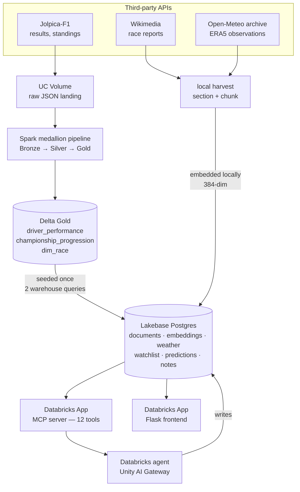

# AI Formula 1 Race Companion — Design

## 1. What this is

An AI companion over Formula 1. A user asks questions in plain language — *"how
wet was the 2024 São Paulo Grand Prix?"*, *"compare Ferrari and McLaren's 2024
form"*, *"which races were decided by rain?"* — and an agent answers from three
sources that agree with each other: race results from a Spark pipeline, the
narrative of race reports, and **measured** race-day weather. It also takes
real actions: saving predictions, tracking drivers, recording notes.

The thing that makes it more than a query interface is that the three sources
are joinable. A race report calls something "a chaotic wet race"; the weather
archive says 17.9 mm fell at Interlagos that day. One is an adjective, the other
is a measurement, and having both lets the agent answer *"which races were
actually wet?"* without trusting an encyclopaedia's choice of words.

## 2. Capstone requirements

| # | Requirement | Where it lives |
|---|---|---|
| 1 | A data pipeline in Spark | `formula1-capstone-project` — Bronze → Silver → Gold, SCD-2 dims, expectations |
| 2 | Integration with ≥1 third-party API | **Three**: Jolpica-F1, Wikimedia, Open-Meteo archive |
| 3 | Processing of unstructured data | Race reports chunked, embedded, searched semantically in Lakebase `pgvector` |
| 4 | A Databricks App with a frontend | MCP server app + Flask frontend app |
| 5 | An AI agent with read **and write** tools | 12 MCP tools — 9 read, 3 write |

There is **no Change Data Feed requirement**. `CDF` and `Change Data Feed`
appear nowhere in the capstone README; an earlier plan treated it as a sixth
mandatory component. Building one would have been unpaid scope.

## 3. Architecture



`dim_race` is the spine. It already carries `wikipedia_url` and
`circuit_lat`/`circuit_long` for all 71 races, which is why the unstructured and
weather tracks need neither a search step nor a geocoding step — both are
addressed directly from data the pipeline already produced.

## 4. The two-store split

| | Delta (analytical) | Lakebase (operational) |
|---|---|---|
| Holds | Bronze/Silver/Gold marts | Serving copies, embeddings, user writes |
| Written by | Spark pipeline | Local loaders, and the agent |
| Read by | The seeding step, once | Every agent turn, both apps |
| Cost per read | SQL warehouse compute | None |

**Why not query Delta from the agent?** Free Edition's daily compute quota is
unrecoverable until the next day. An agent that spends a warehouse query per
question is an agent that stops working mid-demo. Seeding the Gold marts into
Postgres once costs two queries total; every read after that is free.

Delta stays the source of truth. The Lakebase copies are recreated on each seed
rather than migrated, because a stale column left behind by an earlier mart
shape would be a lie rather than history.

## 5. The shared key

Every table in Lakebase carries `(season, round)` — the same key
`f1.silver.dim_race` uses.

That is the whole integration. It means a semantic hit in a race report can
pivot straight into that race's results and its rainfall, and it is why
`search_race_reports` can return `was_wet` and `precipitation_mm` alongside each
passage without any extra plumbing. Two data tracks with a shared key are one
queryable thing; without it they would be two disconnected stores that happen to
be about the same sport.

## 6. Data model

```
f1_races               the spine: season, round, date, circuit, lat/lon, wiki url
f1_documents           race-report sections, one row per (season, round, section)
f1_embeddings          chunk-level, VECTOR(384), HNSW vector_cosine_ops
f1_race_weather        measured race-day observations, one row per (season, round)
f1_driver_performance  seeded from Delta Gold
f1_championship        seeded from Delta Gold

f1_watchlist           tracked drivers/constructors/circuits   ← agent WRITE
f1_predictions         pre-race predictions with rationale     ← agent WRITE
f1_race_notes          free-text analyst notes                 ← agent WRITE
```

## 7. Design decisions

Each of these was expensive to reverse, so each was chosen from evidence.

### 7.1 Lakebase `pgvector`, not Databricks Vector Search

Free Edition allows one AI Search endpoint with one search unit, and Direct
Vector Access is unsupported. A pgvector path was already proven end-to-end on
this same Lakebase instance. Reuse beat novelty.

HNSW over IVFFlat: IVFFlat picks its centroids at build time and needs
representative rows to already exist, which is wrong for a table that starts
empty and grows. The index uses `vector_cosine_ops` to match the `<=>` operator
used at query time — an index built with a different opclass is *silently
ignored* and degrades to a full scan with no error.

### 7.2 Embeddings computed locally

A Free Edition serverless notebook is memory-killed while loading
`sentence-transformers`/`torch`, dying before any embedding work starts.
Embedding on the laptop and writing vectors over the network costs zero
Databricks compute. Vectors are bound in pgvector's text form and cast with
`%s::vector` inside the `execute_values` row template, so the column holds real
vectors on insert — the common alternative writes `double precision[]` and needs
a follow-up `UPDATE … ::vector` whose omission makes search return nothing at
all, with no error.

### 7.3 Wikipedia as the corpus, addressed not searched

`dim_race.wikipedia_url` is populated for 71 of 71 races, so the corpus is
pre-addressed: no title construction, no disambiguation between "2024 Brazilian
Grand Prix" and "Brazilian Grand Prix". Articles are split by section so a
retrieval hit can cite *"from the Race report section"*; navigation and
standings sections are dropped because in plain-text form they embed as walls of
digits that pollute every result.

### 7.4 Weather as measurement, with an explicit threshold

Observations come from Open-Meteo's ERA5 archive at the circuit's coordinates on
the race date. A race is `was_wet` at **1.0 mm** — roughly where rain stops
being a passing shower and starts affecting tyre choice and grip. The threshold
is a named constant, stored on every row and quoted in the tool docstring, so
the agent can explain a claim rather than assert it.

The archive trails real time by about five days. Recent races are **skipped, not
recorded as zero rainfall** — "no data" and "no rain" are different claims, and
conflating them would quietly corrupt every wet-race query.

### 7.5 Thin tools, one broker

No `psycopg2` call and no HTTP call appears inside any `@mcp.tool` function.
Every query and every write lives in `f1_broker.py`; the tools validate, call
one broker function, and shape the result. The F1 logic is therefore testable
with a plain Python call — no agent, no MCP client, no deployed app.

### 7.6 Resolution is returned, never assumed

Users say "Verstappen"; the data says `driver_id='max_verstappen'`. Every read
returns what it actually matched, so a wrong match is visible in the answer
rather than silently wrong. An **ambiguous** name raises instead of picking the
first row — "Schumacher" should produce a question, not a guess.

## 8. Failure modes and how they are handled

| Failure | Handling |
|---|---|
| Unknown driver | `unknown_driver` with candidates listed; the agent asks which |
| Unknown race | `unknown_race`; the agent asks for a round or name |
| No weather observation | `weather_available: false` with a note that this means **no data**, not fair weather |
| Upstream API throttling | Retry-After honoured, exponential backoff with jitter, resumable harvest |
| Bad upstream URL | Recorded in a failures file, not worked around |
| Duplicate section headings | Repeats suffixed, both bodies kept |

Tools return structured error dicts rather than raising, each with a
`suggestion` field naming the remedy. A tool failure becomes a clarifying
question instead of an invented result.

## 9. Bugs found during the build

Recorded because each one changed the design.

**Writes silently rolled back.** `INSERT … RETURNING` run through the read
helper returned a real row with a real id — so a write looked entirely
successful — but the helper never committed, and closing the connection rolled
it back. An agent would have told a user "saved" and the database would have
disagreed. Only a read-back-after-write test catches this; trusting the write's
own return value does not. Writes now go through a separate `returning()` helper
that commits, documented as not interchangeable.

**Wikipedia throttled at exactly ten requests.** A 0.2s delay and a generic
User-Agent, both wrong under Wikipedia's policy: 49 of 59 articles failed with
HTTP 429. Fixed with a compliant agent string, Retry-After handling, backoff
with jitter, and resume support.

**Duplicate document ids.** The 2025 Las Vegas article repeats the heading
"Race". Since a document id derives from `(season, round, section)`, that
produced two rows with the same id in one batch, which Postgres rejects outright
with *"ON CONFLICT DO UPDATE command cannot affect row a second time"*.

**A wrong key guess costs a warehouse query.** The seeding step originally
assumed `driver_ref`; the marts use `driver_id`. Keys are now auto-detected from
candidates, validated for existence *and* uniqueness, and query results are
cached so a failure after a successful query does not pay for it twice.

## 10. Limitations

- **Weather is daily, not session-level.** ERA5 gives one observation per day;
  a race that started dry and ended wet reads as its daily total. Hourly data
  would fix this and is the obvious next step.
- **One upstream URL is wrong.** Jolpica gives the 2026 Barcelona GP a
  `wikipedia_url` of `2026_Barcelona-Catalunya`, which does not exist — 58 of 59
  reports harvested. Recorded rather than patched around.
- **Wikipedia is not authoritative.** It is a good narrative source and a poor
  record of fact; every number the agent reports comes from the pipeline or the
  weather archive, never from the prose.
- **Predictions are not scored.** They are stored with a rationale but never
  resolved against the actual result. Closing that loop is the most interesting
  extension.
- **Single user.** Every write is keyed `user_id='default'`. The column exists
  so multi-user is a change of value, not of schema.
- **No automated tests.** Verification was done by calling every tool through a
  real MCP client and reading results back out of Lakebase.
