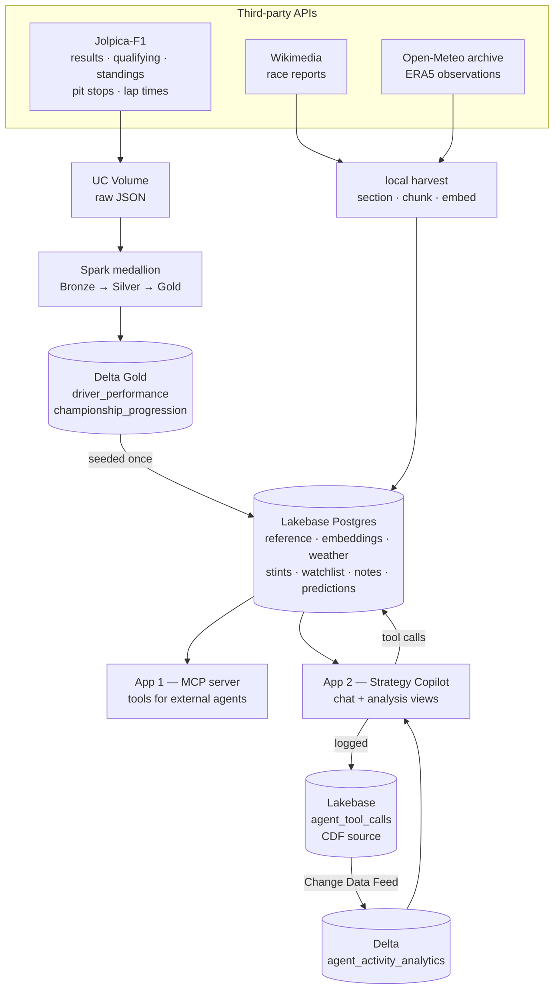

# AI Formula 1 Race Strategy Copilot — Design

## 1. The problem

After a Grand Prix, the interesting question is never *what* happened — the
results table answers that in one line. It is **why**.

*Why did Ferrari lose a race they led? Was McLaren's undercut the right call, or
did the safety car just fall their way? Which races were actually decided by
strategy rather than pace?*

Answering that today means holding three incompatible sources in your head at
once:

| Source | Answers | Cannot answer |
|---|---|---|
| Results & timing tables | *what* happened, precisely | *why* it happened |
| Race report prose | *why*, in expert language | anything numeric or comparable |
| Weather records | what the conditions were | when, within the race, they mattered |

Nobody joins them. A results API will not tell you a stop was slow *because* the
front-left stuck. A race report will not tell you the second stint ran 0.4 s/lap
slower. A weather archive reports a daily total and cannot tell you the track was
dry when the race actually started.

**This project joins all three on `(season, round)` and puts an agent in front of
them**, so a question that needs evidence from all three gets one grounded answer.

## 2. Who it is for

**The post-race analyst** — journalist, team-side analyst, or a serious fan
writing about the sport. They have a specific race and a specific suspicion, and
they need evidence for or against it, fast.

Not a daily tool. Neither is a trip planner. What matters is whether one session
does real work, and "explain this race with evidence" is an hour of manual
cross-referencing compressed into a question.

## 3. What it does

- **Explains outcomes** — combines finishing data, pit-stop timing, stint pace
  and the race report's own account.
- **Compares** drivers and constructors over a season or at one circuit.
- **Investigates strategy** — undercut and overcut evidence, stop counts, who
  gambled on a safety car and whether it paid.
- **Checks conditions honestly** — measured rainfall alongside what the report
  says about the track *during* the race, because those disagree more often than
  you would expect.
- **Records the work** — saves an analysis, tracks a driver or team, logs what
  you expect next time at this circuit.

## 4. The finding that shaped the design

The obvious question — *does rain cause chaos?* — has a boring answer at first
glance. Across 59 races, going from any race to ≥15 mm of rain moves the
retirement rate only from **12.5% to 15.7%**.

The individual races say something far more interesting:

| Race | Rainfall | Retired | What the report says |
|---|---|---|---|
| 2024 Italian (Monza) | **19.1 mm** | 5.0% | *"a greater chance of rain than initially forecast"* |
| 2025 Japanese | 16.9 mm | 0.0% | — |
| 2024 São Paulo | 17.9 mm | 25.0% | *"held in rainy conditions on a wet track"* |
| 2025 Australian | 17.7 mm | 30.0% | *"intermediate"* tyres throughout |

The wettest race on record was among the calmest. The archive reports a **daily
total** and cannot distinguish rain that fell overnight from rain that fell
during the race. Semantic search surfaces the Miami report saying it outright:
*"Although rain had fallen earlier on Sunday, the track was dry by the time the
race began."*

**This is why the unstructured layer is load-bearing rather than decorative.**
Delete the embeddings and the product cannot answer its own core question.
Causation lives in the prose; the numbers alone will mislead you.

## 5. Architecture



## 6. The two-store split

| | Delta (analytical) | Lakebase (operational) |
|---|---|---|
| Holds | Bronze/Silver/Gold marts, agent analytics | Serving copies, embeddings, stints, user writes |
| Written by | Spark pipeline, CDF materialisation | Local loaders, the agent |
| Read per agent turn | never | always |
| Compute cost | one-time seed | none |

Free Edition's daily compute quota is unrecoverable until the next day. An agent
that spends a warehouse query per question is an agent that dies mid-demo, so
Gold is seeded into Postgres once — **two warehouse queries total** — and every
read thereafter is free.

## 7. Change Data Feed loop

Every agent tool call is recorded in Lakebase. Change Data Feed carries those
changes into a Delta analytics table, and the app reads it back to show which
tools get used, how often writes happen, and how long calls take.

This closes the loop the rubric asks for: **operational writes → CDF → Delta
analytics → surfaced in the app.** It is also genuinely useful — it is the only
way to see what the agent is actually doing rather than what it claims.

## 8. Data model

```
-- reference and analysis
f1_races                 season, round, date, circuit, lat/lon, wikipedia url
f1_driver_performance    seeded from Delta Gold
f1_championship          seeded from Delta Gold
f1_race_weather          measured race-day observations
f1_pit_stops             per-driver stop lap, time of day, duration
f1_stints                reconstructed from stops: stint number, laps, pace
f1_documents             race-report sections
f1_embeddings            chunk-level, VECTOR(384), HNSW vector_cosine_ops

-- the agent writes here
f1_watchlist             tracked drivers / constructors / circuits
f1_predictions           what the analyst expects next time
f1_race_notes            saved analysis
agent_tool_calls         every call — CDF source for the analytics loop
```

Everything carries `(season, round)`, the key `f1.silver.dim_race` already uses.
That is the whole integration: a semantic hit in a race report pivots straight
into that race's stops, stints, weather and results.

## 9. Design decisions

**Lakebase pgvector, not Databricks Vector Search.** Free Edition allows one AI
Search endpoint with one search unit and no Direct Vector Access. A pgvector path
was already proven end-to-end here. HNSW over IVFFlat, because IVFFlat picks
centroids at build time and needs representative rows to already exist —
wrong for a table that starts empty. `vector_cosine_ops` matches the `<=>`
operator; a different opclass is *silently ignored* and degrades to a full scan.

**Embeddings computed locally.** A Free Edition serverless notebook is
memory-killed loading `sentence-transformers`/`torch`, dying before any embedding
starts. Local embedding costs no Databricks compute.

**The agent runs in-process in the frontend, and over MCP for external clients.**
Both call the same `f1_broker` functions, so a bug is a bug in both rather than a
divergence between them. Calling the MCP app from the UI app would mean a second
OAuth hop to reach functions already importable.

**Thin tools, one broker.** No SQL and no HTTP appears inside any tool function.
The F1 logic is testable with a plain Python call — no agent, no MCP client, no
deployed app.

**Resolution is returned, never assumed.** Users say "Verstappen" and "Monza";
the data says `max_verstappen` and `Italian Grand Prix`. Every read reports what
it matched. An *ambiguous* name raises rather than picking the first row.

## 10. Explicitly out of scope

Stated because a reviewer will look for them:

- **Tyre compounds.** Jolpica inherits Ergast's schema, which has no compound
  field — that is FastF1/OpenF1 territory. Tyre strategy is therefore answered
  from the race report's own "Tyre choices" section, not from a table.
- **Pace-degradation simulation.** A real "what if they had two-stopped" model
  needs a degradation curve this data cannot support. What is offered instead is
  **counterfactual comparison from observed data** — what actually happened to
  drivers who took the other option — which is a weaker claim with real evidence
  behind it.
- **Live timing.** Everything here is post-race.

## 11. Known failure modes

| Failure | Handling |
|---|---|
| Unknown driver / race | Structured error naming candidates; the agent asks |
| No weather observation | `weather_available: false` — means **no data**, never "fair weather" |
| Upstream throttling | Retry-After honoured, exponential backoff, resumable harvest |
| Bad upstream URL | Recorded in a failures file, not worked around |
| Agent loops on tools | Hard turn cap, then answers from what it has |

## 12. Bugs found during the build

Each changed the design.

**Writes silently rolled back.** `INSERT … RETURNING` through the read helper
returned a real row with a real id — so a write looked successful — but never
committed. An agent would tell a user "saved" and the database would disagree.
Only read-back-after-write catches this.

**`databricks sync` honours `.gitignore`.** Ignoring the generated app payload
silently stripped it from the deployment; the app would have failed on import.
There is no way to have the payload deployed but untracked, so it is committed
and regenerated by a build script.

**Wikipedia throttled at exactly ten requests.** A 0.2 s delay and a generic
User-Agent, both wrong under Wikipedia's policy — 49 of 59 articles failed.

**Circuit names did not resolve.** People say "Monza"; the resolver matched only
`race_name`, so the agent burned three extra tool calls retrying.
