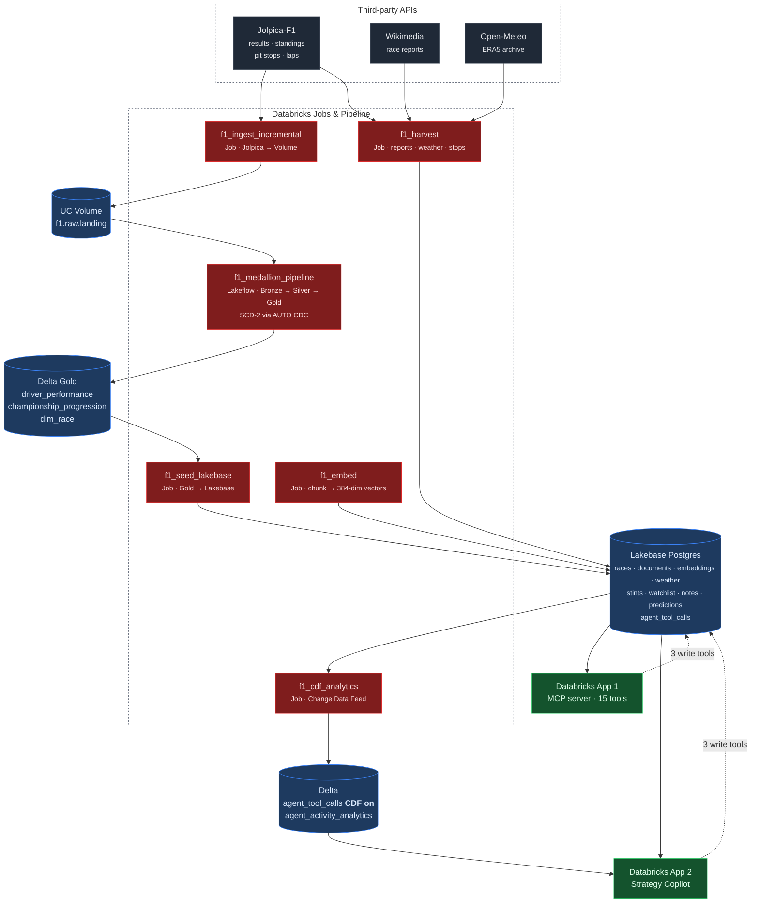

# AI Formula 1 Race Strategy Copilot

**Capstone idea: custom** — the domain is Formula 1 rather than one of the five
listed options. It follows the same skeleton: Lakebase relational tables,
embeddings over unstructured text for semantic retrieval, and an agent whose
tools both read and write.

| | |
|---|---|
| **Repository** | <https://github.com/abhibastia/f1-strategy-copilot> (branch `main`) |
| **Strategy Copilot app** | <https://f1-companion-ui-7474646797973312.aws.databricksapps.com> |
| **MCP server app** | <https://mcp-f1-race-companion-7474646797973312.aws.databricksapps.com> |
| **MCP endpoint** | `https://mcp-f1-race-companion-7474646797973312.aws.databricksapps.com/mcp` |

> **Apps auto-stop after 24 hours on Free Edition.** If a URL does not respond,
> restart it: `databricks apps start <name> --profile <profile>`.
>
> **On the two names.** The Databricks app is called `mcp-f1-race-companion`,
> from an earlier framing of this project as a race companion. Databricks app
> names are immutable and baked into the URL, and recreating an app to rename it
> is not worth the risk on a workspace where app creation has been unreliable.
> Everything user-facing — the UI, the MCP server identity, the health
> endpoints, the User-Agent strings — says **F1 Strategy Copilot**. The URL is
> the one place the old name survives.

---

## 1. What it does and why

After a Grand Prix the interesting question is never *what* happened — the
results table answers that in a line. It is **why**. *Why did Ferrari lose a
race they led? Was the undercut the right call, or did the safety car simply
fall their way?*

Answering that means holding three incompatible sources together:

| Source | Answers | Cannot answer |
|---|---|---|
| Results and timing | *what* happened, precisely | *why* |
| Race report prose | *why*, in expert language | anything numeric or comparable |
| Weather records | the conditions | **when**, within the race, they mattered |

This project joins all three on `(season, round)` and puts an agent in front of
them.

### The finding that shaped the design

Rain looks like it should cause chaos. Across 59 races, moving from *any race*
to *≥15 mm of rain* shifts the retirement rate only from **12.5% to 15.7%**.
The individual races say something better:

| Race | Rainfall | Retired | What the report says |
|---|---|---|---|
| 2024 Italian (Monza) | **19.1 mm** | 5.0% | *"a greater chance of rain than initially forecast"* |
| 2024 São Paulo | 17.9 mm | 25.0% | *"held in rainy conditions on a wet track"* |
| 2025 Australian | 17.7 mm | 30.0% | *"intermediate"* tyres throughout |

The wettest race on record was among the calmest. A weather archive reports a
**daily total** and cannot distinguish rain that fell overnight from rain that
fell during the race. The narrative can.

**This is why the embeddings are load-bearing rather than decorative.** Delete
them and the product cannot answer its own core question, because causation
lives in the prose. See [`DESIGN.md`](DESIGN.md) for the full reasoning.

---

## 2. Architecture



**Dataflow in one line:** three APIs → Spark medallion (Delta) + local harvest →
Lakebase serving layer → agent reads and writes → tool calls flow back to Delta
through Change Data Feed → surfaced in the app.

**Why two stores.** Delta is analytical, Lakebase is operational. Free Edition's
daily compute quota is unrecoverable until the next day, so an agent that spends
a warehouse query per question dies mid-demo. Gold is seeded into Postgres once —
**two warehouse queries total** — and every read after that is free.

---

## 3. Repository layout

| Path | What |
|---|---|
| `pipeline/` | **Spark medallion pipeline**: ingestion, Bronze→Gold, Asset Bundle, validation SQL |
| `harvest/` | Wikipedia race reports, Open-Meteo weather, Jolpica pit stops and laps |
| `f1lake/` | Lakebase schema, loaders, embedding, Gold→Lakebase seeding |
| `mcp_server/` | MCP server app — 15 tools over streamable HTTP |
| `app/` | Strategy Copilot app — frontend, in-process agent, queries |
| `notebooks/` | Change Data Feed → Delta analytics job |
| `tests/` | Unit tests for chunking, resolution, thresholds, stints |
| `data/` | Harvested source data and the agent demo transcripts |

---

## 4. Setup

### 4.1 Prerequisites

- Databricks Free Edition workspace, **identity verified** (unlocks outbound
  internet for in-platform API calls)
- Databricks CLI ≥ 0.294, authenticated: `databricks auth login --profile <profile>`
- Python 3.11+ locally
- A Lakebase project, and a Unity Catalog catalog named `f1`
  (**Free Edition cannot create catalogs over the API** — make it once in the UI:
  Catalog → Create catalog → `f1` → Default storage)

### 4.2 Secrets

One secret: a base64-encoded Postgres connection URL for a **native** Postgres
role, so setup is a single value rather than five environment variables.

```bash
databricks secrets create-scope database --profile <profile>
printf 'postgresql://<role>:<password>@<host>:5432/databricks_postgres?sslmode=require' \
  | base64 \
  | databricks secrets put-secret database lakebase-url --profile <profile>
```

Grant **both** app service principals read access — app SPs are not members of
`users`, so a group grant is not enough and the app will boot fine then fail on
its first database call:

```bash
for APP in mcp-f1-race-companion f1-companion-ui; do
  SP=$(databricks apps get "$APP" --profile <profile> -o json \
        | python3 -c 'import json,sys; print(json.load(sys.stdin)["service_principal_client_id"])')
  databricks secrets put-acl database "$SP" READ --profile <profile>
done
```

### 4.3 Environment variables

Copy [`.env.example`](.env.example). No API keys exist in this project —
Jolpica, Wikimedia and Open-Meteo are all free and keyless.

| Variable | Purpose | Default |
|---|---|---|
| `LAKEBASE_SECRET_SCOPE` / `LAKEBASE_SECRET_KEY` | where the connection URL lives | `database` / `lakebase-url` |
| `EMBEDDING_MODEL` | must match the model that built the vectors | `sentence-transformers/all-MiniLM-L6-v2` |
| `F1_LANDING_DIR` | landing files for the race spine | `~/Projects/formula1-capstone-project/landing` |
| `WIKI_USER_AGENT` | Wikipedia requires a contact string | placeholder |

### 4.4 Local environment

```bash
python -m venv .venv && .venv/bin/pip install -r requirements-dev.txt
export DATABRICKS_CONFIG_PROFILE=<profile>
```

### 4.5 Runtime

Everything is **serverless** — no cluster to size. The Lakeflow pipeline and the
jobs run on serverless compute; the apps run on Databricks Apps compute. Library
requirements are declared per component in `requirements-dev.txt`,
`mcp_server/requirements.txt` and `app/requirements.txt`.

---

## 5. Running each component end to end

### Step 1 — Spark pipeline (Databricks)

```bash
cd pipeline
./scripts/create_catalog.sh                        # schemas + landing Volume
databricks bundle validate --strict -t dev --profile <profile>
databricks bundle deploy -t dev --profile <profile>
databricks jobs run-now --json '{"job_id":<id>,"only":["ingest"]}' --profile <profile>
databricks bundle run f1_medallion_pipeline -t dev --profile <profile>
```

The `f1_ingest_incremental` job calls the Jolpica API **from inside Databricks**
and lands raw JSON in `f1.raw.landing`; the Lakeflow pipeline reads it with Auto
Loader through Bronze → Silver → Gold. Writes are idempotent: a round is *closed*
once a later round exists with a non-empty results payload, and closed rounds are
skipped, so a re-run makes ~8 API calls rather than ~260.

Sample input data: `data/pitstops/*.json` is committed. The full landing set is
reproducible with `python3 pipeline/ingestion/ingest.py --mode backfill --root ./landing`.

### Step 2 — Harvest text and weather (local, no Databricks compute)

```bash
python -m harvest.run                    # 58 race reports + 59 weather observations
python -m f1lake.load                    # chunk, embed, load to Lakebase
python -m f1lake.load_strategy           # pit stops → derived stints
python -m f1lake.seed_gold               # Gold marts → Lakebase (2 warehouse queries)
```

Embedding runs locally on purpose: a Free Edition serverless notebook is
memory-killed loading `sentence-transformers`/`torch`, dying before any embedding
begins.

### Step 3 — Deploy the two apps

```bash
./scripts/build_app.sh mcp_server && ./scripts/build_app.sh app
databricks sync mcp_server /Workspace/Users/<you>/mcp-f1-race-companion --profile <profile> --full
databricks apps start  mcp-f1-race-companion --profile <profile>
databricks apps deploy mcp-f1-race-companion \
  --source-code-path /Workspace/Users/<you>/mcp-f1-race-companion --profile <profile>
# repeat for app/ → f1-companion-ui
```

> `apps deploy` fails on a stopped app with *"not in RUNNING state"* — start first.
> `app.yaml` must sit at the **root** of the synced path.

### Step 4 — Change Data Feed analytics

```bash
databricks workspace import /Workspace/Users/<you>/f1-strategy-copilot/cdf_agent_analytics \
  --file notebooks/cdf_agent_analytics.py --language PYTHON --format SOURCE --overwrite --profile <profile>
databricks jobs submit --json @cdf_job.json --profile <profile>
```

### Step 5 — Tests

```bash
.venv/bin/python -m pytest tests/ -q                    # 77 tests
.venv/bin/python -m pytest tests/ -q -m "not integration"   # 29, no database needed
```

48 tests are marked `integration` and open a real Lakebase connection. They are
not mockable in any useful way: the bug they exist to catch — an
`INSERT ... RETURNING` that returns a row and then rolls back when the
connection closes — only reproduces against a real one. They clean up every row
they write.

CI (`.github/workflows/checks.yml`) runs the credential-free subset, plus
`pyflakes` and the pipeline expectation checker. It deliberately does not run
the integration tests, because that would mean putting a live database password
into repository secrets to buy a green tick.

### Step 6 — One-command refresh

Rebuilds everything Lakebase serves, in dependency order, reporting the row
counts each stage changed:

```bash
python3 scripts/full_refresh.py --dry-run     # what would run, and current counts
python3 scripts/full_refresh.py               # network + Lakebase stages only
python3 scripts/full_refresh.py --with-spark  # also the Gold seed and CDF job
python3 scripts/full_refresh.py --only embed  # a single stage
```

The Spark stages are opt-in because they spend against Free Edition's daily
compute quota, which does not reset until the next day. Every stage is
idempotent, so interrupting a run and starting again is safe.

### Step 7 — Schema and smoke test

```bash
python3 -m f1lake.schema --ensure   # create every table and index (idempotent)
python3 -m f1lake.schema --smoke    # write one row, read it back, delete it
```

`--smoke` is the fastest way to confirm the write path works end to end:

```
  connecting     … ok
  wrote          … id 27
  read back      … id 27
  cleaned up     … ok
```

The read-back is the point. It opens a **new** connection, because a write that
was never committed still returns a plausible row to the caller that made it.

---

## 6. The agent

**15 tools — 12 read, 3 write.** Full definitions in
[`mcp_server/f1_mcp_server.py`](mcp_server/f1_mcp_server.py); the in-app agent
uses the same `f1_broker` functions so both surfaces run identical code.

| Read | Write |
|---|---|
| `get_driver_season` · `compare_constructors` | **`add_to_watchlist`** |
| `get_championship_standings` · `get_race_weather` | **`log_prediction`** |
| `find_wet_races` · `search_race_reports` | **`save_race_note`** |
| `get_race_strategy` · `find_strategy_races` | |
| `get_season_schedule` | |
| `get_watchlist` · `get_predictions` · `get_race_notes` | |

`get_season_schedule` exists so a conversational follow-up can resolve. Every
other per-race tool needs the race named up front, which left "what about the
next race in that season?" unanswerable — the model passed the phrase through as
a race name, failed to resolve it, and answered from a report search instead.

Writes mutate Lakebase and return the row they stored, so the agent confirms
rather than asserts. Ten example transcripts — strategy, evidence, narrative, comparison, three
writes and two guardrails — with the exact tool calls the agent made, are in
[`RESULTS.md`](RESULTS.md). The raw JSON including the full tool results the
model saw is in [`data/demo_transcripts.json`](data/demo_transcripts.json).

**Guardrails.** Never state a figure not returned by a tool; follow the
`suggestion` field on an error rather than guessing; report what a name resolved
to, so a wrong match is visible; treat missing weather as *no data*, never as
*fair weather*.

### Using it

The copilot is docked to the left of every page rather than placed in the
scroll, because a reader reaching the strategy table — the point most likely to
raise a question — should not have to scroll back several screens to ask it.
Collapsible; below 68rem it becomes an overlay so the tables keep the width.

Every answer shows the calls that produced it **and what each one returned**:

```
READ  get_race_weather(race="Monza", season=2024)
  ↳ Italian Grand Prix · 19.1 mm · heavy rain · flagged wet by rainfall
READ  search_race_reports(query="Monza 2024 wet or dry track", top_k=5)
  ↳ 5 passages · top 0.51
```

A tool name on its own proves nothing — it reads the same whether the tool
answered or returned an empty row. The value is what makes the trace evidence,
and it is why the answer above ("the report does not mention the track being
wet") can be checked rather than trusted.

Weather deliberately reports **"flagged wet by rainfall"** rather than "wet
race": `was_wet` is derived from the daily total alone, so the short form sat
directly above answers correctly saying the track was dry.

Writes are marked in red with the stored row id, and link to section 06 where
the row appears. Follow-up chips are regenerated from each answer's tool calls,
so a suggestion can only ever be a question this corpus can answer.

---

## 7. Unstructured data and retrieval

58 Wikipedia race reports → 728 sections → **1,065 chunk embeddings**
(`all-MiniLM-L6-v2`, 384-dim) in Lakebase `pgvector`, HNSW with
`vector_cosine_ops` to match the `<=>` operator used at query time.

Wired into queries in `f1_broker.search_reports`, which joins each hit to that
race's measured weather so narrative and measurement can be checked against each
other. Example results are in [`RESULTS.md`](RESULTS.md); the app's search box
calls the same path.

---

## 8. Change Data Feed loop

```
Lakebase agent_tool_calls          agent writes here on every tool call
   │  MERGE, idempotent on id
   ▼
f1.gold.agent_tool_calls           Delta, delta.enableChangeDataFeed = true
   │  table_changes()
   ▼
f1.gold.agent_activity_analytics   per-tool calls, writes, errors, latency
   │
   ▼  app section 07
```

Reading the feed rather than rescanning the base table is the point: a full
rescan gives the same numbers today and stops being true the moment history is
corrected or backfilled.

**Note on terminology.** The pipeline also uses **CDC** —
`dp.create_auto_cdc_flow(..., stored_as_scd_type=2)` maintains SCD Type 2
dimensions so Gold can join *as of the race date*. That is change capture on
ingest and is distinct from the Change Data Feed loop above.

---

## 9. Known limitations

- **Tyre compounds do not exist in this data.** Jolpica inherits Ergast's schema,
  which has no compound field. Tyre strategy is answered from the race report's
  own "Tyre choices" section instead.
- **No pace-degradation simulation.** A genuine "what if they had two-stopped"
  model needs a degradation curve this data cannot support. What is offered is
  counterfactual comparison against what actually happened.
- **Weather is a daily total.** ERA5 gives one observation per day — which is the
  project's central finding, not a hidden flaw.
- **One upstream URL is wrong.** Jolpica gives the 2026 Barcelona GP a
  `wikipedia_url` that does not exist; 58 of 59 reports harvested. Recorded in
  `data/race_reports_failures.json` rather than worked around.
- **Lap times are harvested but not yet used** for per-stint pace (57/59 races).
- **Single user.** Writes are keyed `user_id='default'`; the column exists so
  multi-user is a change of value, not of schema.
- **First search in a container is slow.** `search_race_reports` averages ~4 s
  against ~100 ms for the SQL tools, because the embedding model loads on first
  use per container. Subsequent calls are fast. Visible in the app's own
  analytics, which is the point of surfacing them.
- **The published dashboard can serve a stale snapshot.** Tiles added after the
  last publish render empty until it is republished; the underlying queries are
  correct, and `pipeline/sql/dq_event_log.sql` returns the same numbers.
